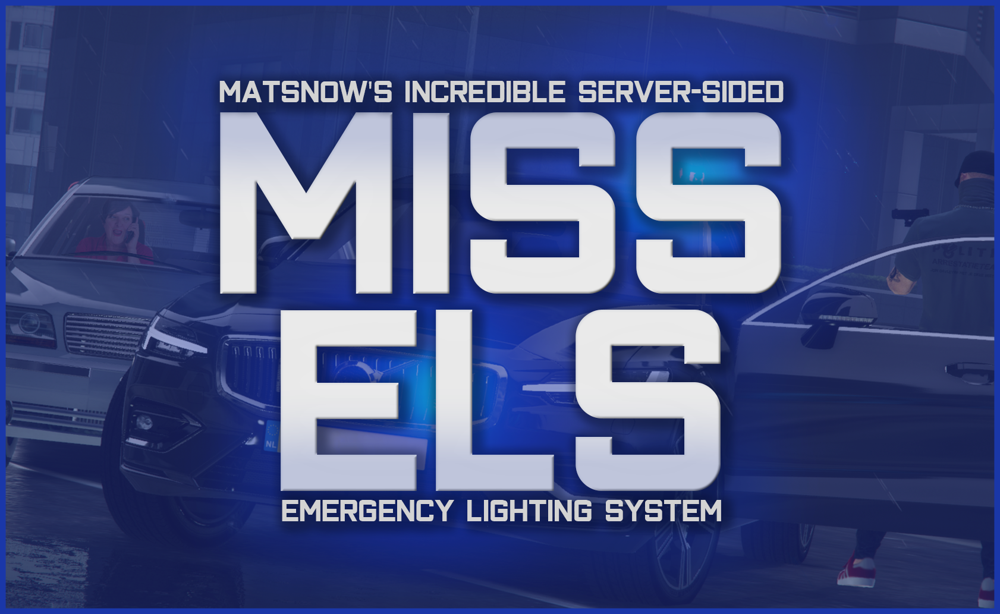

# MISS-ELS: Matsn0w's Incredible Server-Sided ELS

MISS-ELS is an all-in-one configurable Emergency Lighting System (ELS) for the popular Grand Theft Auto V (GTA V) multiplayer client called FiveM.

The server-side element restricts controls to the driver (and optionally his passengers) and allows you to activate primary, secondary and warning lighting each with individually configurable key-bindings. Welcome to the best server-sided Emergency Lighting System for FiveM!

Oh, and you might ask yourself where all the 'Els' or 'Miss Els' jokes come from. It's a [meme](https://youtu.be/X-PgamXIWRQ?t=75). Loes is calling her grandchild Els. Els? Els! ELS!

## Key Features

* Sirens and lights synced across the entire server
* Customizable light patterns per vehicle
* Use native game sirens or use your own with [WMServerSirens](https://github.com/Walsheyy/WMServerSirens)
* A simple yet comprehensive configuration
* Support for 3 different light stages
* Support for up to 4 different sirens per vehicle
* Optional light reflections around the vehicle
* Indicator controls
* Customizable keybinds
* [A simple VCF configuration wizard](https://matsn0w.github.io/MISS-ELS)

*...and more!*

## Requirements

You need to have the following resources installed on your server:

* [FiveM baseevents](https://docs.fivem.net/docs/resources/baseevents) (shipped by default)
* [NativeUILua](https://github.com/FrazzIe/NativeUILua/releases/latest)

## Installation and Configuration

See the instructions in the [documentation](docs/README.md)!

## Vehicle Configuration Files

If you have any existing VCF files from the original author of this resource, then you'll probably be fine. The XML should be fully backwards compatible. If you have a VCF from any other resource, that'll most likely not work.

In both cases, it's probably best to re-create them by either writing them yourself OR... use my convient configuration GUI! Using this tool, you can easily generate configuration files for your vehicles. You can find it [here](https://matsn0w.github.io/MISS-ELS)!

## Questions or problems?

Please read the [documentation](docs/README.md) first and check the [Q&A section](https://github.com/matsn0w/IIS-EmergencyLS-ELS-FiveM/discussions/categories/q-a) on Github if your question has already been asked. It probably is!

Didn't find and answer? Then feel free to [start a new topic](https://github.com/matsn0w/IIS-EmergencyLS-ELS-FiveM/discussions/new?category=q-a). The community is here to help you!

Found a bug? Please [make an issue](https://github.com/matsn0w/MISS-ELS/issues/new)!

## Changelog

### v2.0.0

* Added configuration option to allow passengers to control the sirens
* Added configuration option to customize indicator controls
* Added configuration option to customize environmental light reflections
* Added new documentation
* Added `/extra <extra>` command to quickly toggle a vehicle extra
* Added a VCF configuration GUI
* VCF: Added `AllowUse` flag to enable or disable the main horn
* VCF: Added `SoundSet` flag to specify a custom sound for the main horn
* VCF: It's no longer needed to specify flash numbers within a pattern (Flash01, Flash02, etc. can now be Flash Flash Flash!)
* Fixed `AllowEnvLight` setting not doing anything
* Fixed `AudioString` on MainHorn not doing anything
* Updated SLAXML parser to version 0.8
* Lots of code improvements and optimizations

### v1.2.0 - v1.3.0

Original releases from [Infinite Impact Solutions](https://github.com/InfImpSolutions)

## Video Demonstration (+ Installation)

*Note that this video was made for version 1.x of this resource.*

